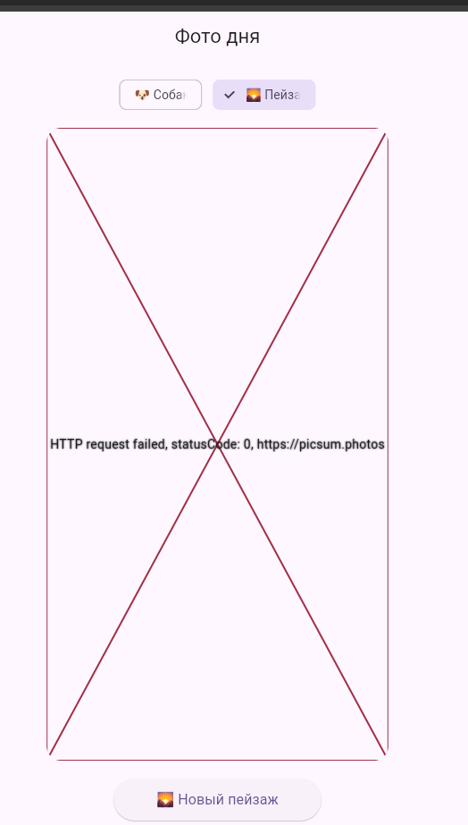

# 📸 Фото дня (Photo of the Day)

Flutter-приложение, которое загружает и отображает случайные фотографии (собак или пейзажей) из открытых API. Демонстрирует принципы асинхронного программирования, работу с сетевыми запросами и управление состоянием виджетов в реальном времени.

## 👤 Информация об авторе
- **ФИО:** Лепилкин Макисм Александрович
- **Группа:** ИСП-232

## 🛠 Стек и версии
- **Flutter:** 3.0+
- **Dart:** 3.0+
- **Платформа:** Web (Chrome)
- **Ключевой пакет:** `http`

## 🖼 Скриншот приложения

## 🚀 Запуск
1. `git clone <url_репозитория>`
2. `cd photo_of_the_day`
3. `flutter pub get`
4. `flutter run -d chrome`

## 📚 Что изучили
1. Концепцию асинхронности и отличие синхронного выполнения от асинхронного.
2. Работу с `Future<T>`, ключевыми словами `async` и `await` для управления асинхронным потоком.
3. Обработку исключений в асинхронном коде с помощью `try/catch`.
4. Выполнение HTTP-запросов через пакет `http` и парсинг JSON-ответов (`jsonDecode`).
5. Управление состоянием UI через `setState`, использование индикаторов загрузки и работу с сетевыми/локальными изображениями.

## ❓ Ответы на вопросы

1. **Что такое `Future<T>`? Чем отличается от обычного возвращаемого значения?**  
   `Future<T>` — это объект-«обещание», который гарантирует возврат значения типа `T` в будущем. В отличие от обычного значения, которое возвращается синхронно и сразу доступно, `Future` не блокирует выполнение программы, пока операция не завершится, и предоставляет результат позже.

2. **Что делает `await`? Блокирует ли он весь поток выполнения?**  
   `await` приостанавливает выполнение **текущей функции** до момента завершения `Future` и получения результата. Он **не блокирует** основной поток (Event Loop), поэтому интерфейс приложения остаётся отзывчивым, а другие задачи могут выполняться параллельно.

3. **Зачем `setState()` вызывается дважды в `_fetchPhoto()`?**  
   Первый вызов сразу после начала запроса устанавливает `_isLoading = true` и сбрасывает предыдущий результат, чтобы UI мгновенно показал индикатор загрузки. Второй вызов происходит после успешного получения данных (или ошибки), устанавливает `_isLoading = false` и обновляет URL изображения, что перерисовывает экран с новым контентом.

4. **Почему кнопке передаётся `_fetchPhoto` без скобок, а не `_fetchPhoto()`?**  
   Передача `_fetchPhoto` без скобок означает, что мы передаём **ссылку на функцию** (callback), которая будет вызвана только в момент нажатия пользователем. Если написать `_fetchPhoto()`, функция выполнится немедленно при каждом вызове `build()`, что приведёт к бесконечному циклу запросов и зависанию интерфейса.

5. **Чем `Image.network()` отличается от `Image.asset()`?**  
   `Image.network()` загружает изображение асинхронно по внешнему URL из интернета. `Image.asset()` загружает изображение из локальной папки проекта (предварительно зарегистрированной в `pubspec.yaml`), не требуя сетевого подключения и работая мгновенно из ресурсов приложения.